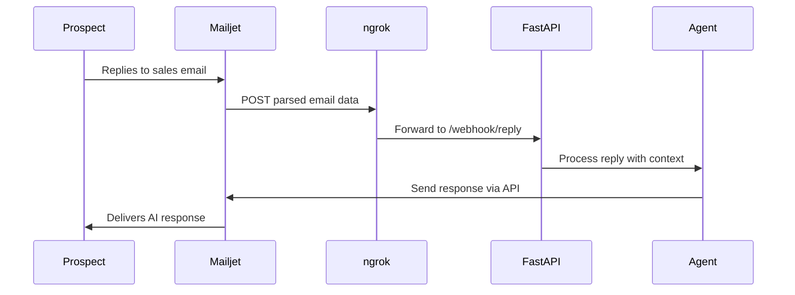

# Mailjet Reply Webhook Implementation

## Why a Separate Python File (Not Notebook)

A webhook server needs to:
- Run continuously waiting for incoming HTTP requests
- Be exposable via ngrok to the internet
- Be started with `uvicorn` or similar ASGI server

Notebooks are designed for interactive, cell-by-cell execution — not for long-running servers. A `.py` file is the right choice here.

## Architecture



## Implementation

### 1. Create `reply_webhook.py`

A new file in `2_openai/` containing:

- **FastAPI app** with a single POST endpoint `/webhook/reply`
- **`send_reply` tool** using Mailjet (matching your existing pattern)
- **SDR Reply Agent** that reads the inbound message and crafts a response
- Endpoint parses Mailjet's Parse API payload and triggers the agent

### 2. Mailjet Parse API Setup (Manual Steps)

You'll need to:
1. Set up a subdomain for receiving emails (e.g., `parse.yourdomain.com`)
2. Configure MX records to point to Mailjet
3. Create a Parse Route in Mailjet pointing to your ngrok URL

### 3. Running the Server

```bash
# Terminal 1: Start the webhook server
uvicorn reply_webhook:app --port 8000

# Terminal 2: Expose via ngrok
ngrok http 8000
```

Then configure Mailjet Parse Route to use the ngrok HTTPS URL.

## Key Differences from the Notebook Code

| Aspect | Notebook | Webhook Server |
|--------|----------|----------------|
| Execution | Cell-by-cell | Continuous server |
| Email direction | Outbound only | Inbound + Outbound |
| Trigger | You run a cell | HTTP POST from Mailjet |

## Files to Create

- `2_openai/reply_webhook.py` — the webhook server (~60 lines)